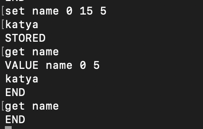
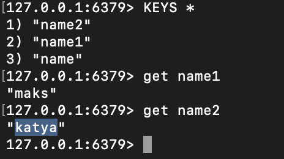

# Домашнее задание к занятию "`Кеширование Redis/memcached`" - `Сергеева Екатерина`

### Инструкция по выполнению домашнего задания

   1. Сделайте `fork` данного репозитория к себе в Github и переименуйте его по названию или номеру занятия, например, https://github.com/имя-вашего-репозитория/git-hw или  https://github.com/имя-вашего-репозитория/7-1-ansible-hw).
   2. Выполните клонирование данного репозитория к себе на ПК с помощью команды `git clone`.
   3. Выполните домашнее задание и заполните у себя локально этот файл README.md:
      - впишите вверху название занятия и вашу фамилию и имя
      - в каждом задании добавьте решение в требуемом виде (текст/код/скриншоты/ссылка)
      - для корректного добавления скриншотов воспользуйтесь [инструкцией "Как вставить скриншот в шаблон с решением](https://github.com/netology-code/sys-pattern-homework/blob/main/screen-instruction.md)
      - при оформлении используйте возможности языка разметки md (коротко об этом можно посмотреть в [инструкции  по MarkDown](https://github.com/netology-code/sys-pattern-homework/blob/main/md-instruction.md))
   4. После завершения работы над домашним заданием сделайте коммит (`git commit -m "comment"`) и отправьте его на Github (`git push origin`);
   5. В личном кабинете прикрепите и отправьте ссылку на решение в виде md-файла в вашем Github.
   6. Любые вопросы по выполнению заданий спрашивайте в разделе “Вопросы по заданию” в личном кабинете.
   
Желаем успехов в выполнении домашнего задания!
   
### Дополнительные материалы, которые могут быть полезны для выполнения задания

1. [Руководство по оформлению Markdown файлов](https://gist.github.com/Jekins/2bf2d0638163f1294637#Code)

---

### Задание 1
Задание 1. Кеширование
Приведите примеры проблем, которые может решить кеширование.

Приведите ответ в свободной форме.
`1. Чрезмерная нагрузка на диск

Проблема: чтение данных (особенно при случайных выборках или полных сканированиях таблиц) происходит в разы медленнее на дисках, чем в оперативной памяти. При высокой частоте запросов дисковая подсистема БД становится узким местом.
Решение: Кеш (Redis/Memcached) хранит часто запрашиваемые строки или результаты агрегаций в оперативной памяти. БД перестает обращатьтся к  диску на каждый запрос.

2. Высокая конкуренция за блокировки 

Проблема: В реляционных БД (PostgreSQL, MySQL) множество пользователей читают одни и те же «горячие» строки (например, баланс топ-валюты). Это создает блокировки чтения-записи, замедляя даже простые запросы UPDATE.
Решение: Кеш берет на себя все чтение горячих данных. База данных занимается только записью, благодаря чему блокировки практически исчезают.

3. Каскадное замедление из-за репликационного лага.

Проблема: Если была настроена реплика для чтения, чтобы разгрузить master. Из-за задержек репликации (особенно при пакетной записи) пользователь может не увидеть свои свежие данные — они еще не доехали до реплики.
Решение: Уровень кеширования работает поверх реплик. При записи в master кеш сбрасывается. Следующий SELECT пойдет не на реплику с лагом, а поймет, что кеш устарел, сходит в master и наполнит кеш заново.

4. Проблема "Одинаковых сложных подзапросов" 

Проблема: Когда генерируется 1 запрос на список заказов и N запросов на каждого клиента в этих заказах. При N=1000 это убивает БД тысячей маленьких, но тяжелых запросов.
Решение: Кеширование результатов на уровне ORM (L2 cache — кеш второго уровня). БД видит не 1000 запросов "SELECT * FROM users WHERE id = ?", а только первый. Остальные 999 возвращаются из прозрачного кеша Hibernate.

5. Проблема Лавина запросов

Проблема: Когда к БД идет много повтаряющихся запросов то может возникнуть ситуция с нехваткой подключений (connection pool overflow).
Решение: Кеш Redis с паттерном Mutex (блокировка). Только один запрос идет в БД за значением, остальные ждут в очереди к кешу или спят. БД видит один запрос вместо 50 000.

6. Медленная работа индексов при фильтрации по неиндексируемым полям

Проблема: В БД нужно искать JSON внутри поля или делать поиск по регулярному выражению. Индексы тут почти не помогают (или нужен полнотекстовый поиск, которого нет).
Решение: Кеш хранит итоговый массив ID записей, подходящих под сложный фильтр. Вместо тяжелого поиска по диску БД делает быстрый SELECT * FROM table WHERE id IN (кешированный_список).

7. Проблема "Разрастания WAL логов" 

Проблема: Каждое изменение в PG/MySQL пишется в лог (WAL). Если мы часто читаем одни и те же данные и дополнительно часто их пересчитываем (например, статистика пользователя), это порождает тонны мусорных записей в WAL и FSYNC операций.
Решение: Перекладываем вычисление статистики из БД в приложение, а финальный результат — в кеш. Теперь вместо 1000 UPDATE в час (раздувающих WAL) будет записана в основную БД только 1 раз в сутки (snapshot). WAL чист и мал.

8. Снижение эффективности буферного кеша СУБД

Проблема: База данных тратит свой собственный буферный кеш (например, innodb_buffer_pool_size) на данные, которые запрашиваются очень редко. В итоге "горячие" данные вытесняются из буфера БД "холодными".
Решение: Внешний специализированный кеш (Redis) забирает на себя все чтение "горячих" ключей. Буферный пул БД теперь используется только для записи и случайных чтений. Это повышает общий Hit Ratio СУБД.`

---

### Задание 2
Задание 2. Memcached
Установите и запустите memcached.

Приведите скриншот systemctl status memcached, где будет видно, что memcached запущен.

---

### Задание 3
Задание 3. Удаление по TTL в Memcached
Запишите в memcached несколько ключей с любыми именами и значениями, для которых выставлен TTL 5.

Приведите скриншот, на котором видно, что спустя 5 секунд ключи удалились из базы.

### Задание 4
Задание 4. Запись данных в Redis
Запишите в Redis несколько ключей с любыми именами и значениями.

Через redis-cli достаньте все записанные ключи и значения из базы, приведите скриншот этой операции.

